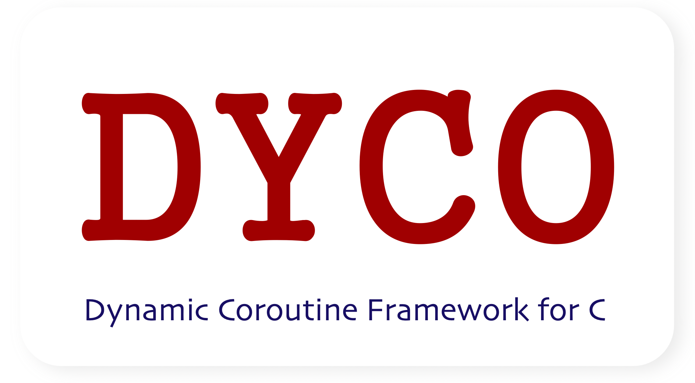
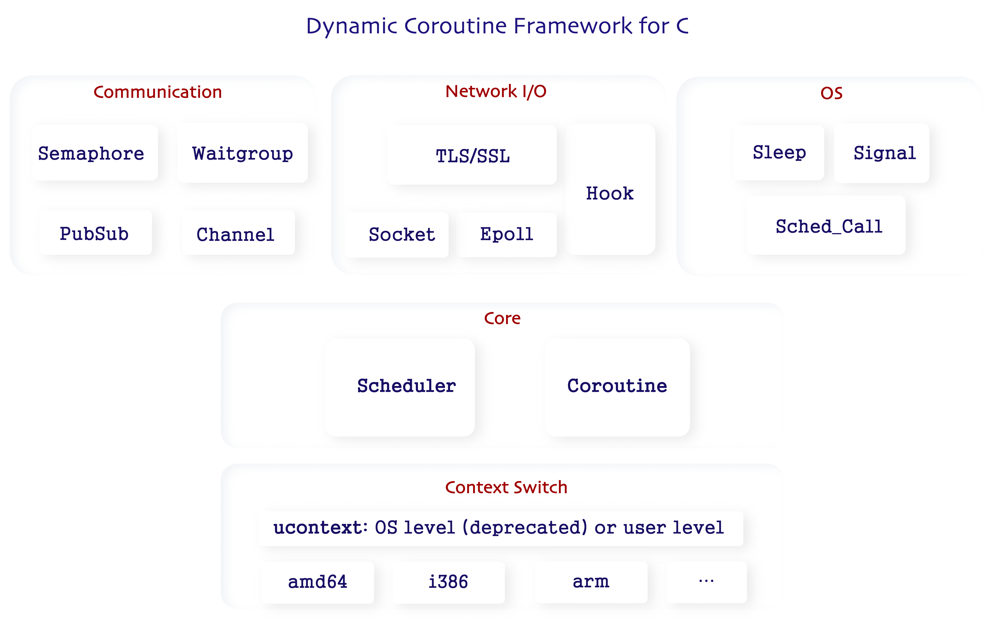

# dyco-coroutine


> Language: [English](./README.md) | [中文](./README_ZH.md)

☄️ **dyco-coroutine** is a dynamic coroutine framework for C. I hope this framework to be TRULY **practical** and **user-friendly**, rather than just a coroutine demo. This framework was first inspired by the `wangbojing/NtyCo` project. Some other projects are also referred, such as `cloudwu/coroutine`, `jamwt/libtask` and `stevedekorte/coroutine`.

With this framework, programers can achieve asynchronous I/O performance by programming in a synchronous manner. And I want this framework to work out-of-the-box: you just create a coroutine to run your functions, and I'll provide all tools that you need (such as scheduler, socket and synchronization), then all the functions run as coroutines do. Besides, I provide detailed examples that covers almost all supported features of dyco. Anyone can get started within 5 minite by reviewing and running these examples.

Features of dyco-coroutine:
1. Fully automated coroutine scheduling.
2. Either shared or separate stacks can be set for coroutines.
3. Coroutines pool for better performance.
4. Socket/epoll hooks to automatically change the behavior of the socket/epoll API.
5. Wait signal events. Especially waitchild, which is works well with `fork()+exec()`.
6. Allow epoll inside each coroutine without blocking the scheduler.
7. Half duplex channel and Publish-Subcribe channel for coroutine communication.
8. Semaphore and Waitgroup for coroutine synchronization.
9. TLS/SSL non-block concurrent server support.
10. Scheduler and be stopped by any coroutine, and continue running in main process.
11. Multi-thread supported.



There are still some future works:
1. Better cross-platform support. Currently the cross-platform design is derive from `jamwt/libtask`. But only Linux OS is supported. Future work can be referred to `heiher/hev-task-system` and `tboox/tbox`.
2. Discover more feature requests and bugs by getting more people to use them.
3. Performance optimization. Using ucontext predestines the framework to not be the best at switching performance. But there is still room for optimization.
4. Simpler build solution. Don't make things more complicated.
5. Asymmetric Coroutines support.

You can give me a 🌟, or recommend it to others if you found dyco-coroutine helpful. And feel free to open issues or pull requests to make this project better. 🌈

# Build

```bash
# 1. Preparation
# optional
$ sudo apt install libssl-dev
$ sudo apt install libhiredis-dev
# optional for meson build
$ sudo apt install meson
$ sudo apt install ninja-build
$ sudo apt install pkg-config

# 2. Build with GNU make
# run make
$ cd dyco-coroutine
$ make

# run example
$ ./bin/xxx_example

# optional: install shared library after build
$ sudo make install

# just link this library
$ gcc -o someoutput somecode.c -ldyco

# uninstall
$ sudo make uninstall

# 3. Build with Meson + ninja
# run meson build
$ meson build_dir
$ cd build_dir
$ meson compile

# run example
$ build_dir/example/xxx_example

# optional: install shared library after build
$ cd build_dir
$ sudo ninja install

# just link this library
$ gcc -o someoutput somecode.c -ldyco

# uninstall
$ cd build_dir
$ sudo ninja uninstall
```

# Get Started

```c
#include "dyco_coroutine.h"
#include <arpa/inet.h>

// Pass the arguments by pointer.
struct foobarargs {
	int	arg1;
	char	*arg2;
};

void foobar(void *arg)
{
	// Get the arguments by pointer.
	struct foobarargs *args = arg;

	int cid, fd, client, ret, status;

	// coroID can be obtained
	cid = dyco_coroutine_coroID();

	// Get Udata if necessary
	dyco_semaphore *sem;
	dyco_coroutine_getUdata(cid, &sem);

	// Create other coroutines if necessary
	dyco_coroutine_create(foobar, NULL);

	// Use dyco_coroutine_sleep() instead of sleep()
	dyco_coroutine_sleep(1000);

	// Use dyco_xx socket API if COROUTINE_HOOK is undefined
	fd = dyco_socket(AF_INET, SOCK_STREAM, 0);
	client = dyco_accept(fd, xxx, yyy);
	ret = dyco_recv(client, xxx, yyy, 0);
	ret = dyco_recv(client, xxx, yyy, 0);
	dyco_close(client);

	// Use normal socket API if COROUTINE_HOOK is defined
	fd = socket(AF_INET, SOCK_STREAM, 0);
	client = accept(fd, xxx, yyy);
	ret = recv(client, xxx, yyy, 0);
	ret = recv(client, xxx, yyy, 0);
	close(client);

	ret = fork();
	if (ret == 0) {
		exec(...)
	}
	else if (ret < 0) {
		return;
	}

	// Wait child for 3000 ms. Set timeout to -1 to wait until child process is finished
	ret = dyco_signal_waitchild(ret, &status, 3000);
	
	// Use dyco_epoll api if COROUTINE_HOOK is not defined
	dyco_epoll_create(...)
	dyco_epoll_add(...)
	dyco_epoll_wait(...)
	dyco_epoll_del(...)
	dyco_epoll_destroy(...)

	// Use normal epoll api if COROUTINE_HOOK is defined
	epoll_wait(...)
	
	return;
}

int main()
{
	// Optional: Pass the arguments by pointer.
	struct foobarargs *args = calloc(1, sizeof(struct foobarargs));

	// Create the corotine
	int cid = dyco_coroutine_create(foobar, args);
	
	// Optional: Set stack if necessary
	dyco_coroutine_setStack(cid, NULL, 4096);

	// Optional: Create semaphore, channel, waitgroup or pubsubchannel
	dyco_semaphore *sem = dyco_semaphore_create(3);

	// Optional: Set Udata if necessary
	dyco_coroutine_setUdata(cid, sem);

	// Run 
	dyco_schedule_run();

	return 0;
}
```

# User APIs

## Coroutine & Coroutines Pool

Some basic coroutine methods are defined here. `sleep/wait/coroID` can only be called inside coroutine functions.

`setStack` is **optional**. If the stack is not set before the coroutine runs. All coroutines whose stack is not set will share the stack of the scheduler. It saves memory space, but costs time for copying stacks when these coroutines yield. Thus, if a coroutine need frequently yield, it's better to set a stack for it. See more in `example/*`.

**Coroutines Pool** is provided to avoid create and release coroutine/stack memory frequently. The coroutines pool can be create at any time and be resized after it created. Coroutines who belongs to a corotines pool will automatically return to the pool after user function finishes. By calling `obtain`, you can get a free coroutine from the pool. See more in `example/coropool_example.c`

```c
// return the coroutine ID on success, < 0 on error
int dyco_coroutine_create(proc_coroutine func, void *arg);

void dyco_coroutine_sleep(uint32_t msecs);

// set timeout to -1 for persistent waiting. set timeout to 0 for no waiting
// return > 0 on success, 0 on timeout, < 0 on error
int dyco_coroutine_waitRead(int fd, int timeout);
int dyco_coroutine_waitWrite(int fd, int timeout);
int dyco_coroutine_waitRW(int fd, int timeout);

// return ID of current coroutine
int dyco_coroutine_coroID();

// stacksize: 0 to cancel independent stack
// return 1 on successfully set, 0 on successfully cancel, < 0 on error
int dyco_coroutine_setStack(int cid, void *stackptr, size_t stacksize);

int dyco_coroutine_getStack(int cid, void **stackptr, size_t *stacksize);

// return 0 on success
int dyco_coroutine_setUdata(int cid, void *udata);
int dyco_coroutine_getUdata(int cid, void **udata);

// return total yield times of a coroutine 
int dyco_coroutine_getSchedCount(int cid);

// return NULL on error
dyco_coropool* dyco_coropool_create(int totalsize, size_t stacksize);
dyco_coropool* dyco_coropool_resize(dyco_coropool* cp, int newsize);

// return 0 on success
int dyco_coropool_destroy(dyco_coropool** cp);

// return number of available coroutine in this pool
int dyco_coropool_available(dyco_coropool* cp);

// obtain a coroutine from the pool. 
// If there is no free coroutine, wait timeout
// return 0 on timeout, -1 on error, > 0 on success
int dyco_coropool_obtain(dyco_coropool* cp, proc_coroutine func, void *arg, int timeout);
```

## Scheduler

Some basic scheduler methods are defined here. In fact, scheduling coroutines is automated in dyco. `create` is **optional**. `run` is enough in most cases. See more in `example/*`.

```c
// return 0 when done, 1 when stopped, < 0 on error
int dyco_schedule_run();

// stack_size: shared stack memory size
// loopwait_timeout: max delay (ms) of starting new coroutine
// return 0 on success
int dyco_schedule_create(size_t stack_size, uint64_t loopwait_timeout);

void dyco_schedule_free(dyco_schedule *sched);

// return ID of current scheduler
int dyco_schedule_schedID();

int dyco_schedule_setUdata(void *udata);

int dyco_schedule_getUdata(void **udata);

// return total number to coroutines of current scheduler
int dyco_schedule_getCoroCount();
```

## Scheduler Call

Scheduler call provides interfaces for coroutines to influence the behavior of its scheduler, such as globally block some signals, stop or abort the scheduler. See more in `example/stop_abort.c`.

```c
// see sigprocmask
int dyco_schedcall_sigprocmask(int __how, sigset_t *__set, sigset_t *__oset);
// stop current scheduler and make it return as soon as possible
void dyco_schedcall_stop();
// shutdown the scheduler and kill its all coroutines
void dyco_schedcall_abort();
```

## poll/epoll

Although programers use coroutine to achieve asynchronous I/O performance by programming in a synchronous manner, the traditional I/O multiplexing manner is also supported by dyco. If `COROUTINE_HOOK` is enabled, call `epoll_wait` will not block the scheduling loop. `dyco_epoll_xxx` APIs is also provided for convenience. See more in `example/epoll.c`.

```c
// return 0 on success
int dyco_epoll_init();
void dyco_epoll_destroy();
int dyco_epoll_add(int fd, struct epoll_event *ev);
int dyco_epoll_del(int fd, struct epoll_event *ev);

// return number of ready events, < 0 on error
int dyco_epoll_wait(struct epoll_event *events, int maxevents, int timeout);

// see epoll_wait
int epoll_wait(int epfd, struct epoll_event *events, int maxevents, int timeout);

// see poll
int poll(struct pollfd *fds, nfds_t nfds, int timeout);
```


## Signal

By calling `dyco_signal` APIs, wait signals will not block the scheduling loop. `waitchild + fork + exec` is helpful in some cases. Other signal is also supported. 

Note that the signals set by calling `signal_init` will be **blocked** until `signal_destroy` is called.

See more in `example/signal.c`.

```c
// return pid of the child on success, < 0 on error
int dyco_signal_waitchild(const pid_t child, int *status, int timeout);
// return 0 on success
int dyco_signal_init(sigset_t *mask);

void dyco_signal_destroy();

// return sizeof struct signalfd_siginfo on success, < 0 on error
int dyco_signal_wait(struct signalfd_siginfo *sinfo, int timeout);
```

## Half Duplex Channel

Half duplex channel is provided for **simple** communications between coroutines. `send` will return only if the channel is empty or the message is received by receiver. See more in `example/channel.c`.

```c
// size: max length of the message
dyco_channel* dyco_channel_create(size_t size);

void dyco_channel_destroy(dyco_channel **chan);

// return the actual sent length, 0 on channel closed, < 0 on error
ssize_t dyco_channel_send(dyco_channel *chan, void *buf, size_t size, int timeout);

// return the actual received length, 0 on channel closed, < 0 on error
ssize_t dyco_channel_recv(dyco_channel *chan, void *buf, size_t maxsize, int timeout);
```

## Publish-subscribe Channel

Pub-Sub channel is provided for **1-to-N** communications. `publish` won't success if there is no subscriber. For each new message, `subscribe` should be called by subscribers, that is, subscribe will not continue automatically. See more in `example/pubsub.c`.

```c
// size: max length of the message
dyco_pubsubchannel* dyco_pubsub_create(size_t size);

void dyco_pubsub_destroy(dyco_pubsubchannel **pschan);

// return the actual published length, 0 on no subscriber, < 0 on error
ssize_t dyco_pubsub_publish(dyco_pubsubchannel *pschan, void *buf, size_t size);

// return the actual received length, < 0 on error
ssize_t dyco_pubsub_subscribe(dyco_pubsubchannel *pschan, void *buf, size_t maxsize, int timeout);
```

## Waitgroup

Waitgroup is provided for **N-to-N** synchronization. Coroutines can join a waitgroup by calling `add`, notify the waitgroup by calling `done`, and wait all or a certain number of other coroutines by calling `wait`. See more in `example/waitgroup.c`.

```c
// suggest_size: estimated max number of coroutines on the waitgroup
dyco_waitgroup* dyco_waitgroup_create(int suggest_size);

void dyco_waitgroup_destroy(dyco_waitgroup **group);

// add coroutine to the waitgroup
int dyco_waitgroup_add(dyco_waitgroup* group, int cid);

// tell the waitgroup this coroutine is done
int dyco_waitgroup_done(dyco_waitgroup* group);

// target: target wait number, set it to -1 to wait until all group member done
// timeout: unit is ms, and set to -1 for persistent waiting
// return > 0 on success, < 0 on error
int dyco_waitgroup_wait(dyco_waitgroup* group, int target, int timeout);
```

## Semaphore

Strictly speaking, each dyco scheduler runs a single thread, where at most one coroutine is running at any time. But these coroutines may ACT LIKE running at the same time. Therefore, semaphore may be helpful in some cases, for example, when we need control the number of active connections. See more in `example/semaphore.c`.

```c
// value: initial value of the semaphore
dyco_semaphore* dyco_semaphore_create(size_t value);
void dyco_semaphore_destroy(dyco_semaphore **sem);

// return 0 on success, < 0 on error or timeout
int dyco_semaphore_wait(dyco_semaphore *sem, int timeout);

// return 0 on success, < 0 on error
int dyco_semaphore_signal(dyco_semaphore *sem);
```

## Socket

dyco socket API can be called the same as socket API, while they will not block the scheduling loop. 
If `COROUTINE_HOOK` is defined, normal socket API will act like dyco socket API. Besides, it will change the behavior of other high level network APIs who call normal socket API in its process, such as database client APIs and DNS APIs. See more in `example/socket_client.c example/socket_server.c example/network.c`.

```c
int dyco_socket(int domain, int type, int protocol);
int dyco_close(int fd);
int dyco_accept(int fd, struct sockaddr *addr, socklen_t *len);
int dyco_connect(int fd, struct sockaddr *name, socklen_t namelen);
ssize_t dyco_send(int fd, const void *buf, size_t len, int flags);
ssize_t dyco_recv(int fd, void *buf, size_t len, int flags);
ssize_t dyco_sendto(int fd, const void *buf, size_t len, int flags,
		    const struct sockaddr *dest_addr, socklen_t addrlen);
ssize_t dyco_recvfrom(int fd, void *buf, size_t len, int flags,
		      struct sockaddr *src_addr, socklen_t *addrlen);
```

## SSL

dyco SSL API is provided to bring great performance gains to SSL communication. But `libssl` and `libcrypto` must be installed before building dyco-coroutine if anyone want to call SSL API. See more in `example/ssl_server.c example/ssl_client`.

**Lack of SSL part is also OK**, the main part of dyco can be built without any dependencies.

```c
// return 1 on success, else on error
int dyco_SSL_accept(SSL *ssl);

// return 1 on success, else on error
int dyco_SSL_connect(SSL *ssl);

// see SSL_read
int dyco_SSL_read(SSL *ssl, void *buf, int num);

// see SSL_write
int dyco_SSL_write(SSL *ssl, const void *buf, int num);
```

# About Coroutine

There are 3 mainstream ways to implement coroutine switch:
- Assembly Instructions. This is faster than other ways, but some code should be written in assembly language for each platform.
- `setjmp()`/`longjmp()`. They are faster than ucontext. But I personally think it is the most inappropriate method of implementing coroutine switch. `setjmp()`/`longjmp()` will loss the stack. To avoid this, you have to set stack pointer in the env_buf structure. This structure is totally different in each platform, so why not use assembly instructions?
- ucontext. This method consists of 4 interfaces which are platform-independent, so the coroutine switch implementation code with ucontext is quite elegant. Unfortunately, **ucontext has been removed from POSIX**, because **the use of function declarators with empty parentheses (not prototype-format parameter type declarators) is an obsolescent feature**. It is still available in Linux, and won't bring problems for dyco. So I choose this method. For supporting more platforms, dyco build ucontext in userspace, and this part is referred to `jamwt/libtask`.
